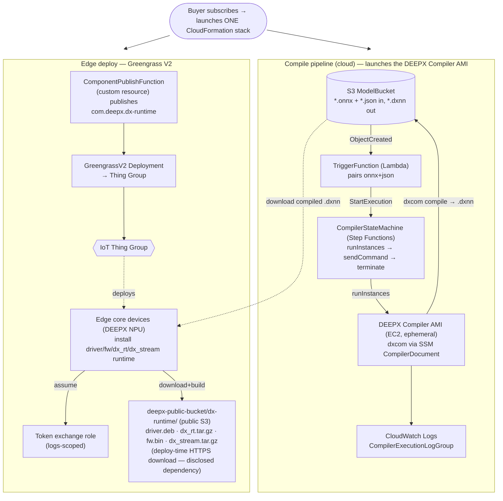

# Architecture — DEEPX Compiler + Greengrass (combined stack)

Logical data flow of the single "AMI with CloudFormation" delivery template
(`infra/dx-compiler-greengrass-marketplace.yaml`). One subscription, one stack,
two capabilities: cloud compile + edge deploy.

> **Marketplace note:** the delivery template requires a **1100×700 px PNG
> architecture diagram using official AWS service icons** (see
> https://aws.amazon.com/architecture/icons). The Mermaid diagram below is the
> logical source of truth; export/redraw it with AWS icons for the listing.

## End-to-end story

1. **Compile**: buyer uploads `model.onnx` + `model.json` to the stack's S3 bucket →
   Lambda pairs them → Step Functions launches the DEEPX Compiler AMI, runs `dxcom`,
   writes `model.dxnn` back to S3, and terminates the instance.
2. **Edge deploy**: the stack publishes `com.deepx.dx-runtime` and creates a Greengrass
   deployment to the thing group; edge NPU core devices join the group and install the
   DEEPX runtime from the public S3 artifacts (`DxRuntimeArtifactBaseUrl`, default
   `https://deepx-public-bucket.s3.ap-northeast-2.amazonaws.com/dx-runtime`).
3. The compiled `.dxnn` is delivered to the edge device and runs on the DEEPX NPU.

## Resource groups (see the template for detail)

- **Compile**: `ModelBucket`, `TriggerFunction` (+role/permission/log group),
  `CompilerDocument`, `CompilerStateMachine` (+2 log groups), `CompilerSecurityGroup`,
  `StepFunctionsRole`, `EC2InstanceRole` + `EC2InstanceProfile`.
- **Edge**: `GreengrassThingGroup`, `GreengrassTokenExchangeRole`,
  `ComponentPublishFunction` (+role), `DxRuntimeComponent`, `GreengrassDeployment`.
